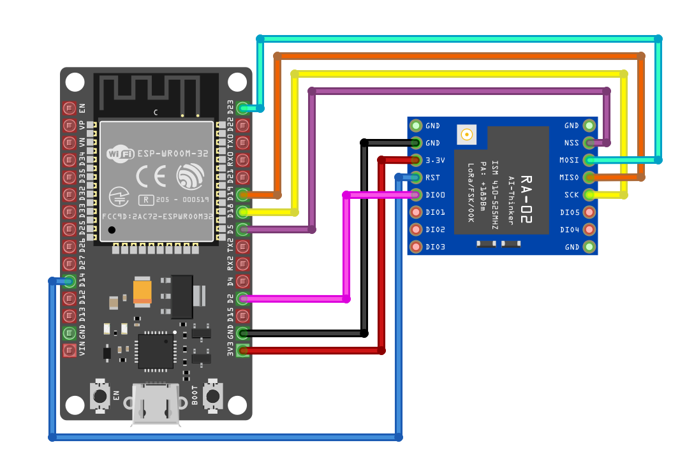
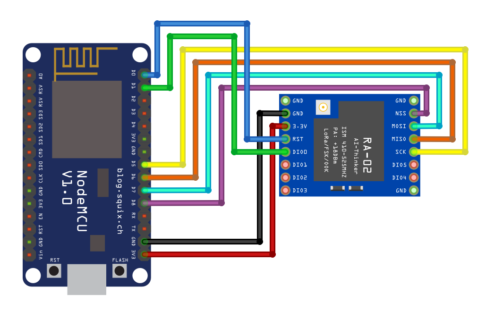

# Comunicación LoRa: Envío y recepción de mensajes entre ESP32 y ESP8266

Se usan 2 módulos LoRa para hacer la comunicación entre un **ESP32** (emisor) y un **ESP8266** (receptor). El ESP32 envía mensajes periódicamente, mientras que el ESP8266 los recibe y los muestra por el puerto serie.
¿Por qué un ESP8266? Porque no tenía otro ESP32 disponible xd

## ¿Qué hace el código?

- El **ESP32** actúa como emisor LoRa, enviando periódicamente un mensaje de texto.
- El **ESP8266** funciona como receptor LoRa, recibiendo y mostrando los mensajes enviados por el ESP32.
- Ambos módulos utilizan la librería [LoRa](https://github.com/sandeepmistry/arduino-LoRa) para la comunicación.
- La velocidad de transmisión y los pines de conexión están configurados para cada placa.

## Descripción de los archivos

- [`src/esp32_emisor.cpp`](src/esp32_emisor.cpp): Código fuente para el ESP32 que envía mensajes LoRa.
- [`src/esp8266_receptor.cpp`](src/esp8266_receptor.cpp): Código fuente para el ESP8266 que recibe mensajes LoRa.

## Conexión

### Conexión de pines

#### ESP32 (Emisor)

| LoRa SX1278 | ESP32 |
|:-----------:|:-----:|
| VCC        | 3.3V |
| GND        | GND  |
| SCK        | GPIO 18 |
| MISO       | GPIO 19 |
| MOSI       | GPIO 23 |
| NSS        | GPIO 5 |
| RST        | GPIO 14 |
| DIO0       | GPIO 2 |

#### ESP8266 (Receptor)

| LoRa SX1278 | ESP8266 |
|:-----------:|:-------:|
| VCC        | 3.3V   |
| GND        | GND    |
| SCK        | D5 (GPIO14) |
| MISO       | D6 (GPIO12) |
| MOSI       | D7 (GPIO13) |
| NSS        | D8 (GPIO15) |
| RST        | D0 (GPIO16) |
| DIO0       | D1 (GPIO5)  |

## Notas importantes

- Ambos módulos LoRa deben estar configurados en la misma frecuencia (en este ejemplo, 433 MHz).
- Usa antenas adecuadas para evitar dañar los módulos LoRa.
- La distancia de comunicación depende de la antena, entorno y configuración de LoRa.
- Puedes modificar el mensaje, la frecuencia o los pines según tus necesidades.
