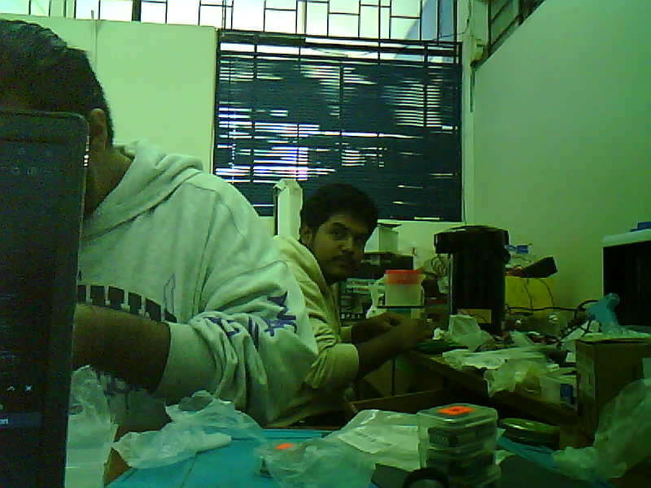

# ESP32-CAM: Captura de imágenes, almacenamiento en microSD y conversión a binario

## Descripción
Esta parte del proyecto utiliza un módulo **ESP32-CAM** (modelo AI-Thinker) para capturar imágenes, almacenarlas automáticamente en una tarjeta microSD y transmitirlas en formato binario por el puerto serie. El sistema está pensado para funcionar de manera autónoma, tomando una foto cada vez que se energiza y entrando en modo de bajo consumo (deep sleep) después de guardar la imagen.

## ¿Qué hace el código?

- Inicializa la cámara y la tarjeta SD.
- Ajusta parámetros de la cámara para optimizar la calidad de la imagen.
- Captura una foto y la guarda en la tarjeta SD con un nombre incremental (`/picture1.jpg`, `/picture2.jpg`, etc.).
- El número de la última foto se almacena en la EEPROM para no sobrescribir imágenes tras reinicios.
- Envía la imagen capturada por el puerto serie en formato binario (útil para pruebas o transmisión remota).
- Pone el ESP32 en modo deep sleep para ahorrar energía hasta el próximo encendido.

## Programar el ESP32-CAM

La IDE utilizada para programar el ESP32-CAM es **PlatformIO**.  
Se ha usado un Arduino UNO R3 como programador. La conexión es la siguiente:


| ESP32-CAM | Arduino UNO R3 |
|:-----------:|:----------------:|
| GND       | GND            |
| VCC       | 5V             |
| U0R       | RXD - 0        |
| U0T       | TXD - 1        |

Se conecta el pin GPIO0 a GND para que el ESP32-CAM entre en modo de programación. Después de cargar el código, se desconectan y se reinicia el ESP32-CAM para que funcione normalmente.

---

## Recepción y reconstrucción de imágenes en PC

Para recibir y reconstruir las imágenes enviadas por el ESP32-CAM, se incluye el script Python [`receive_and_display_image.py`](receive_and_display_image.py). Este script:

- Detecta automáticamente los puertos serie disponibles y permite seleccionar el correcto.
- Espera la transmisión de la imagen en binario desde el ESP32-CAM.
- Guarda la imagen recibida como archivo JPEG.
- Muestra la imagen automáticamente usando el visor predeterminado del sistema.

### Requisitos

- Python 3.x
- [pyserial](https://pypi.org/project/pyserial/) (`pip install pyserial`)
- [Pillow](https://pypi.org/project/Pillow/) (`pip install pillow`)

### Uso

1. Conecta el ESP32-CAM a tu PC y energízalo.
2. Ejecuta el script:

   ```bash
   python receive_and_display_image.py
   ```
3. Selecciona el puerto serie correspondiente cuando el script lo solicite.
4. El script guardará la imagen recibida como ```received_image.jpg``` y la mostrará automáticamente.

## Demostración del código de Python


**Nota:** Si tienes problemas con la recepción, asegúrate de que el puerto serie y la velocidad de baudios coincidan con los configurados en el ESP32-CAM y el script Python.
