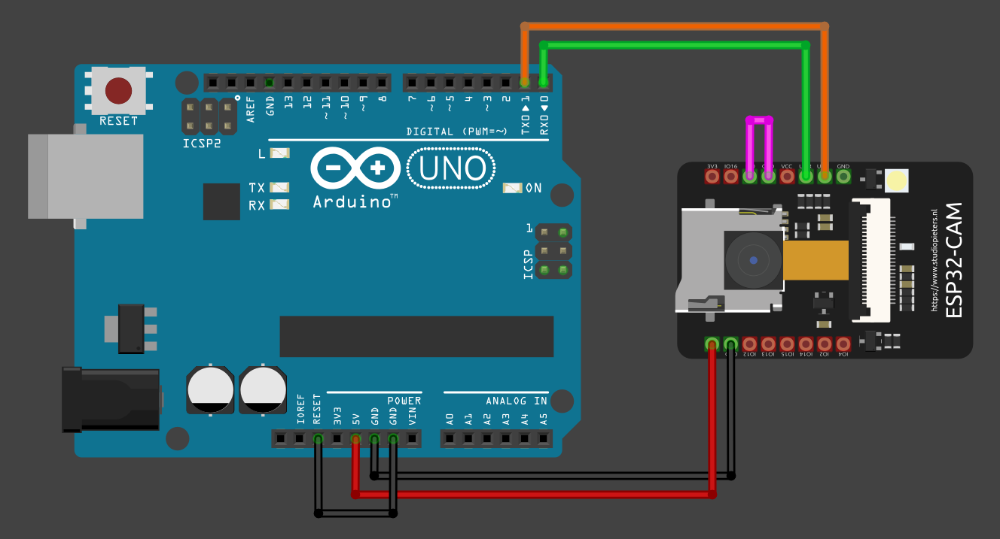

# ESP32-CAM: Captura de imagenes, almacenamiento en microSD y conversión a hexadecimal.

## Descripción
Esta parte del proyecto utiliza un módulo **ESP32-CAM** (modelo AI-Thinker) para capturar imágenes, almacenarlas automáticamente en una tarjeta microSD y convertirlas a formato hexadecimal. El sistema está pensado para funcionar de manera autónoma, tomando una foto cada vez que se energiza y entrando en modo de bajo consumo (deep sleep) después de guardar la imagen.

## ¿Qué hace el código?

- Inicializa la cámara y la tarjeta SD.
- Ajusta parámetros de la cámara para optimizar la calidad de la imagen.
- Captura una foto y la guarda en la tarjeta SD con un nombre incremental (`/picture1.jpg`, `/picture2.jpg`, etc.).
- El número de la última foto se almacena en la EEPROM para no sobrescribir imágenes tras reinicios.
- Envía la imagen capturada por el puerto serie en formato hexadecimal (útil para pruebas o transmisión remota).
- Pone el ESP32 en modo deep sleep para ahorrar energía hasta el próximo encendido.

## Programar el ESP32-CAM

La IDE utilizada para programar el ESP32-CAM es **PlatformIO**.  
Se ha usado un Arduino UNO R3 como programador. La conexión es la siguiente:

| ESP32-CAM | Arduino UNO R3 |
|:-----------:|:----------------:|
| GND       | GND            |
| VCC       | 5V             |
| U0R       | RXD - 0        |
| U0T       | TXD - 1        |

Se conecta el pin GPIO0 a GND para que el ESP32-CAM entre en modo de programación. Después de cargar el código, se desconectan y se reinicia el ESP32-CAM para que funcione normalmente.
