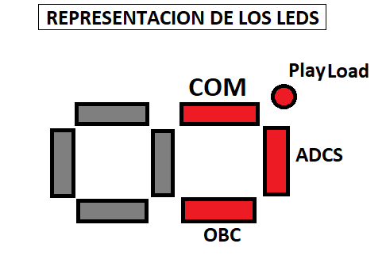

<h1>Primera Version del prototipo</h1>
<ul>
  <li>Se esta usando un display de 7 segmentos para simular salidas led y asi simplificar espacio.</li>
  <li>Los comandos se envian a traves del puerto serial del programa de preferencia con el que se haya subido el codigo</li>
  <li>Por motivos de simplicidad y presupuesto se esta usando una pantalla LED 16x2 para poder simular el giroscopio.</li>
</ul>

Cada led del display representa la activacion o desactivacion de un Subsitema, siempre estan encendidos porque se asume que estan siempre vigente.
 

<h3>Lista de comandos y respuestas</h3>
<ul>
<li><b>0xA1</b> - Pedir datos del EPS; devuelve datos del voltaje de los potenciometros.</li>
<li><b>0xA2</b> - Pedir los datos del giroscopio; devuelve 6 variables enteras.</li>
<li><b>0xB1</b>- Reset al ADCS; Led de ADCS se apaga 1 segundo y luego se enciende.</li>
<li><b>0xB2</b>- Reset al OBC; Led de OBC se apaga 1 segundo y luego se enciende.</li>
<li><b>0xB3</b>- Reset al COM; Led de COM se apaga 1 segundo y luego se enciende.</li>
<li><b>0xC1</b>- Activa el Modo Seguro; Se apaga el LED del PlayLoad y ADCS.</li>
<li><b>0xC2</b>- Desactiva el Modo Seguro; Se enciende el LED del ADCS.</li>
<li><b>0xD1</b>- Activa el PlayLoad o Carga Util; Se enciende el LED del PlayLoad.</li>
<li><b>0xD2</b>- Desactiva el PlayLoad o Carga Util; Se apaga el LED del PlayLoad.</li>
</ul>
